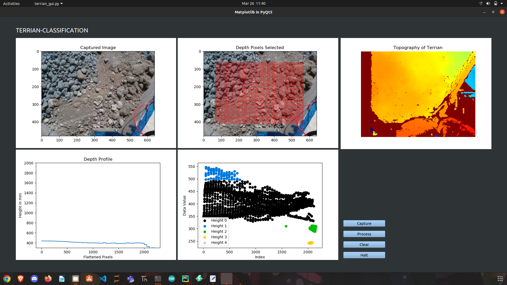

# Terrian Mapping using RealSense Depth Camera 

This program demonstrates the use of the Intel RealSense Depth Camera to capture depth and color images, and process the data using various algorithms. 

## Dependencies

- Python 3.6+
- NumPy
- OpenCV
- PyQt5
- Matplotlib
- realsense2
- sklearn

## Usage

1. Connect the RealSense Depth Camera to the computer.
2. Run the program using the command `python3 terrian_gui.py`.
3. A gui will open
4. Click on the "Capture" button to capture an image.
5. Click on the "Process" button to process the captured image.
6. Click on the "Clear" button to clear the display.

## Features

- Displays the captured image in a Matplotlib canvas.
- Creates a grid of pixels and extracts depth values from the corresponding locations in the depth image.
- Smooths the data using a moving average filter.
- Performs clustering on the data using DBSCAN algorithm.
- Displays the depth profile and cluster plot in Matplotlib canvases.
- Applies color mapping to the depth image for visualization.

## Example

## Credits

This program is developed by Devanshu Sharma as a part of project at VIT, Vellore.It is based on the RealSense SDK and uses code snippets from various online sources.
